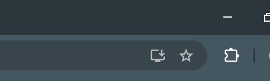

# My Dompet


---

## Deskripsi

**My Dompet** adalah aplikasi pencatatan keuangan berbasis **PWA (Progressive Web App)**. Aplikasi ini dapat digunakan untuk mencatat pemasukan dan pengeluaran secara efisien. Karena menggunakan teknologi PWA, aplikasi dapat berjalan di berbagai platform (web & desktop) tanpa perlu instalasi tambahan.

PWA dipilih karena ringan, mudah digunakan, dan mendukung cross-platform sehingga memberikan pengalaman pengguna yang optimal.

---
## Informasi
- creator: `WiraCode04`
- Model: `Vestia Zeta`
- App Ver: `2.1.0`
- Token: `Z3T4WA1FUKU`
- Create: `2025/07/18`
- Post: `2025/07/18`
- Update: `2025/07/26`
- fitur baru: 1. informasi statistik tunai,
              2. unduh informasi statistik format CSV,
              3. unduh gambar statistik.
  
## Instalasi

Ikuti langkah-langkah berikut untuk menjalankan aplikasi ini di lingkungan pengembangan lokal:

1. Clone repositori ini atau download dalam bentuk ZIP/RAR dan ekstrak.
   ```bash
   git clone https://github.com/wirardicode/MyDompet_pwa.git -b main --single-branch
   
3. Masuk ke folder `Backend`.
4. Buat virtual environment:
   ```bash
   python -m venv <ENV_NAME>
5. Aktivasi Environtmen
- Windows GNU (Shell/bash)
     ```bash
     source <ENV_NAME>/Scripts/activate
- Windows CMD
    ```bash
    <ENV_NAME>\Scripts\activate
- Windows Linux/Mac
    ```bash
    source <ENV_NAME>/bin/activate
5. Install dependensi
    ```bash
    pip install -r requirements.txt
6. Jalanakn pada environtmen Developmen
     ```bash
     fastapi dev main.py
7. Jalankan frontend dengan salah satu opsi berikut:

✅ Rekomendasi: Gunakan ekstensi Live Server di Visual Studio Code

🌐 Gunakan hosting LAN jika mengerti konfigurasi jaringan

🌍 Hosting frontend ke server atau layanan hosting pilihan

8. Import mysql dengan file `mydompet.sql` pada directory `Backend`
9. Unduh aplikasi pada tab browser ->sebelah bookmark(gambar bintang)
    
   
